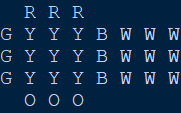

# floppy-cube-text
Text based Floppy Cube (3x3x1 twisty puzzle) simulator, last modified 2019-11-08. Colours are represented by their initials and are printed out like a net.

## Controls

Type 'f' or 'F' to twist the front (O) face.

Type 'r' or 'R' to twist the right (B) face.

Type 'b' or 'B' to twist the back (R) face.

Type 'l' or 'L' to twist the left (G) face.
